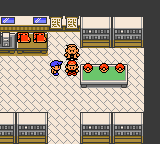

# Pokémon Red DX by David Bluetree

Changes:

- no PP decrease
- better attacks for starters
- window frame like frame #8 from Crystal
- item prices all 1$
- first Potion-Guy gives you Rare Candies etc.
- first Shop sells Rare Candies etc. for 1$
- random encounter x/250 Pokémon
- route#1 can catch 3 Starters and Mew
- route#22 can catch Ho-Oh etc at Lv90

...

This is based on the [**Pokémon Red++v3**][lunared]

[lunared]: https://github.com/JustRegularLuna/rpp-backup
[pokered]: https://github.com/pret/pokered

...

...

...